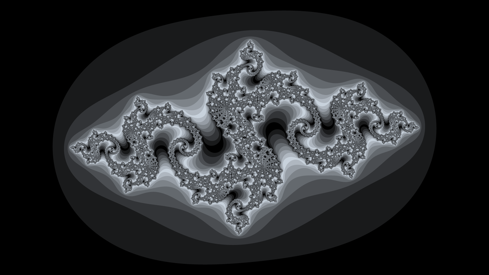

## mandelpng

Create Fractals on the CLI.

The Programs reads config from stdin and writes the resulting image to stdout.

## Examples

`mandelpng-mkconfig > default_config.json`

`mandelpng < default_config.json > result.png`

`jq -rc <your-filter> <your-config-file>.json | mandelpng | magick - <your filters> result.png`

> [!IMPORTANT]  
> Without stdin, the program is executed abnormally because it still waits for input. It can't be called interactively.